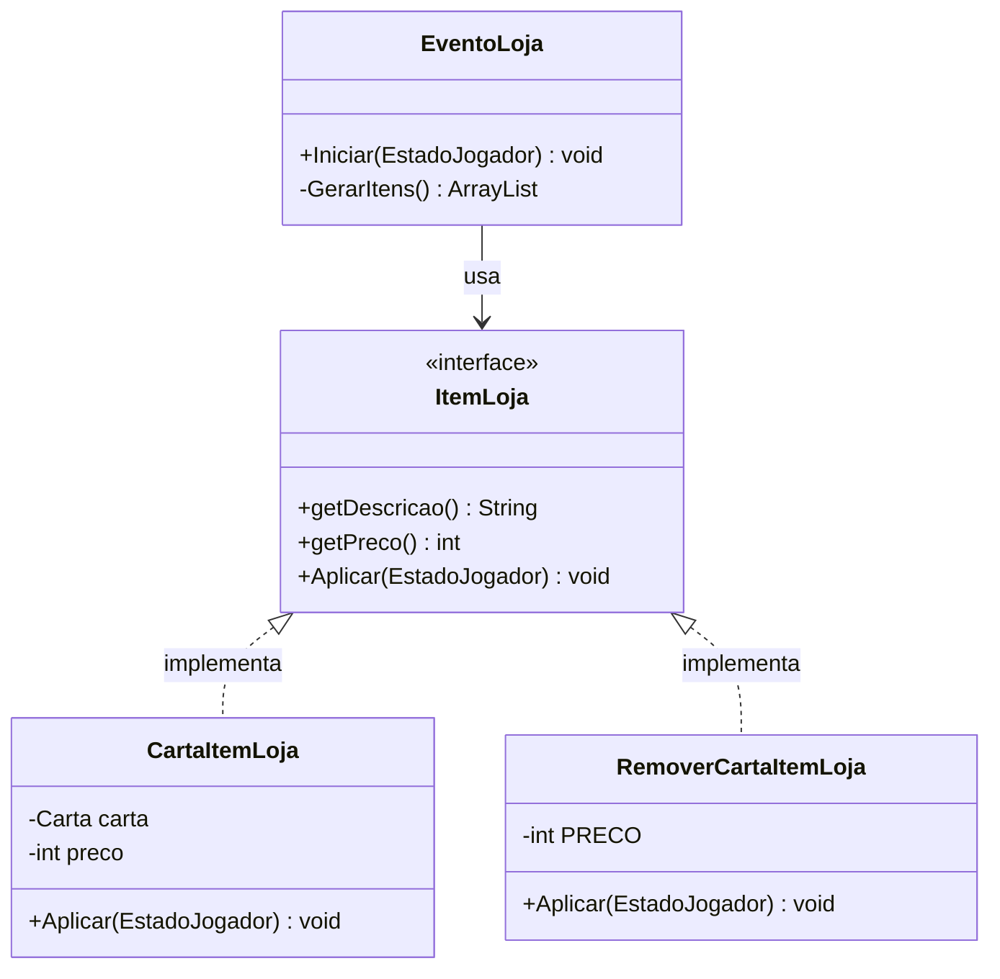
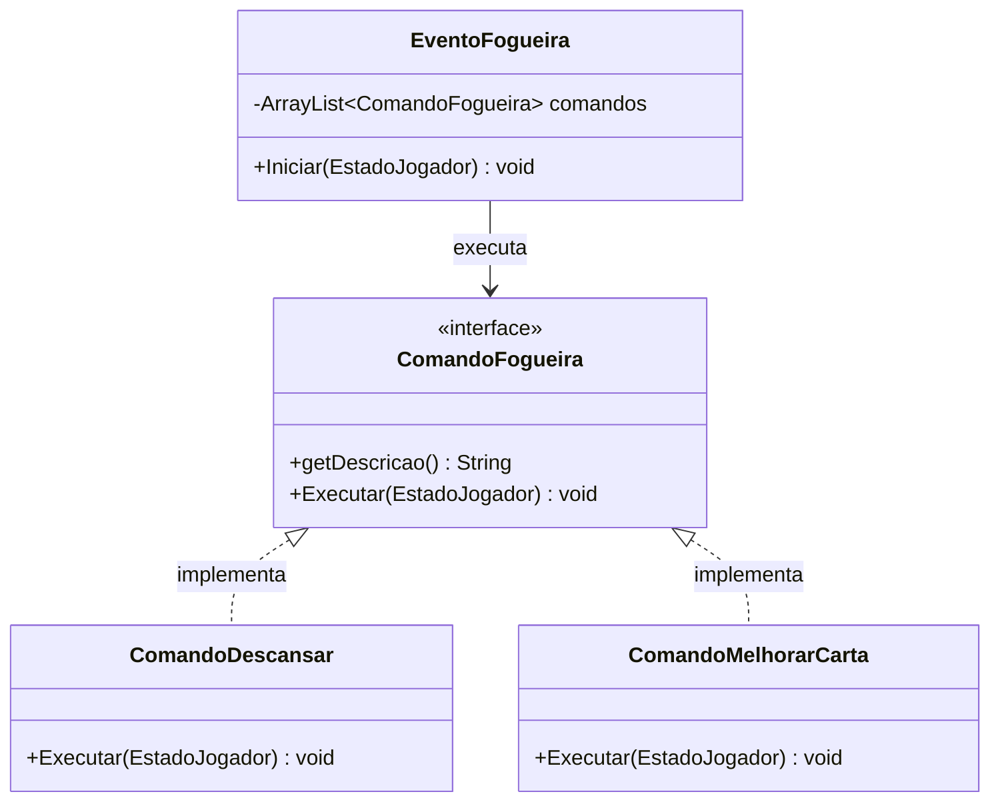

# RPG Game — MC322 Tarefa 6

## Descrição

Jogo de batalha em turnos baseado em *Slay the Spire*. O jogador navega por um mapa em árvore de eventos, mantendo vida, baralho e ouro entre batalhas. Cada caminho oferece combinações diferentes de combates, lojas, fogueiras e escolhas narrativas.

## Mapa do jogo

```
[Rato Gigante] --> [Altar Misterioso] --> [Goblin Feroz] --> [Dragão]     (final)
               --> [Loja]             --> [Fogueira]     --> [Lich das Sombras] (final)
```

## Estado persistente entre batalhas

Entre batalhas são mantidos: HP atual, composição do baralho e ouro. São reiniciados: efeitos ativos, energia e posição das cartas nas pilhas.

## Eventos do mapa

**Batalha:** combate em turnos. Ao vencer, o jogador recebe ouro (20–40) e pode escolher uma nova carta entre 3 opções aleatórias.

**Altar Misterioso (Escolha):** narrativa com três opções — oferecer sangue (-8 HP, +40 ouro), tocar a runa (carta aleatória grátis) ou seguir em frente.

**Loja:** o jogador gasta ouro para comprar cartas aleatórias ou remover uma carta indesejada do baralho.

**Fogueira:** o jogador escolhe entre descansar (recuperar 30% do HP máximo) ou forjar uma carta (aumentar seus atributos permanentemente).

## Sistemas de progressão

---

### Sistema 1 — Loja (padrão Strategy)

**Padrão de projeto:** Strategy
**Fonte:** https://refactoring.guru/design-patterns/strategy

A `EventoLoja` gerencia uma lista de itens à venda. Cada item implementa a interface `ItemLoja`, que define `getDescricao()`, `getPreco()` e `Aplicar(EstadoJogador)`. O comportamento de compra fica encapsulado em cada estratégia concreta, e a loja não precisa conhecer os detalhes de nenhum item específico.

Implementações:
- `CartaItemLoja` — adiciona uma carta ao baralho do jogador.
- `RemoverCartaItemLoja` — remove uma carta escolhida pelo jogador do baralho.

**Diagrama UML:**



---

### Sistema 2 — Fogueira (padrão Command)

**Padrão de projeto:** Command
**Fonte:** https://refactoring.guru/design-patterns/command

A `EventoFogueira` mantém uma lista de `ComandoFogueira`. Cada ação disponível ao jogador é encapsulada como um objeto de comando com `getDescricao()` e `Executar(EstadoJogador)`. Para adicionar novas ações à fogueira basta criar uma nova implementação — sem alterar o código da fogueira.

Implementações:
- `ComandoDescansar` — cura 30% do HP máximo do herói.
- `ComandoMelhorarCarta` — permite ao jogador escolher uma carta do baralho para melhorar (aumenta atributos permanentemente; só pode ser feito uma vez por carta).

**Diagrama UML:**



---

## Efeitos implementados

**Veneno:** ao final do turno do jogador, causa X de dano e perde 1 acúmulo. Dissipa ao chegar a zero.

**Força:** quando o dono ataca, causa X de dano adicional. Aplicado pelo inimigo em si mesmo.

**Fraqueza:** quando o dono ataca, causa X de dano a menos. Aplicada via carta.

## Como compilar

```bash
./gradlew build
```

## Como executar

```bash
./gradlew run
```
